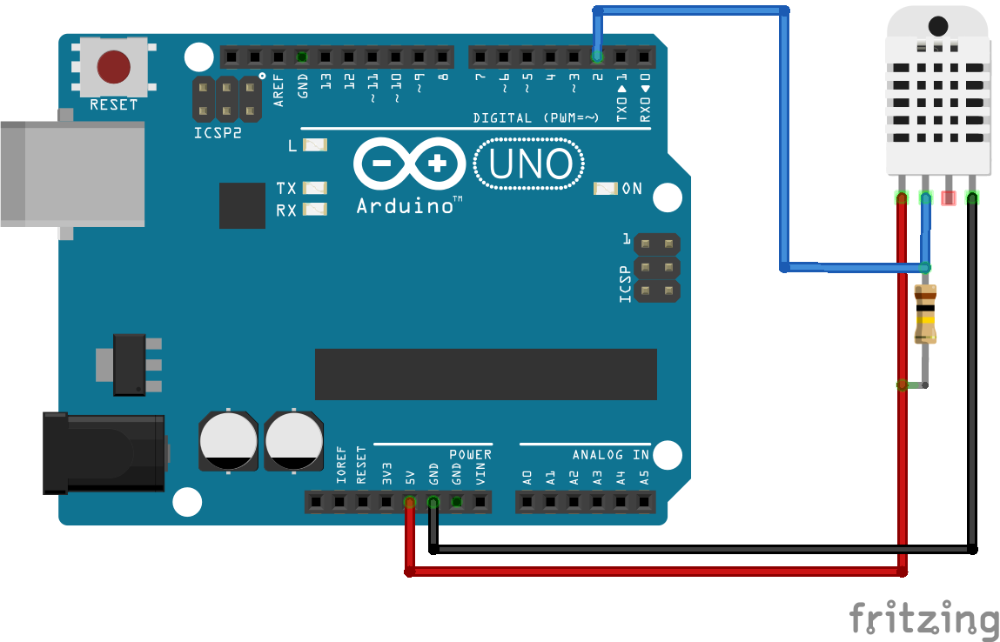
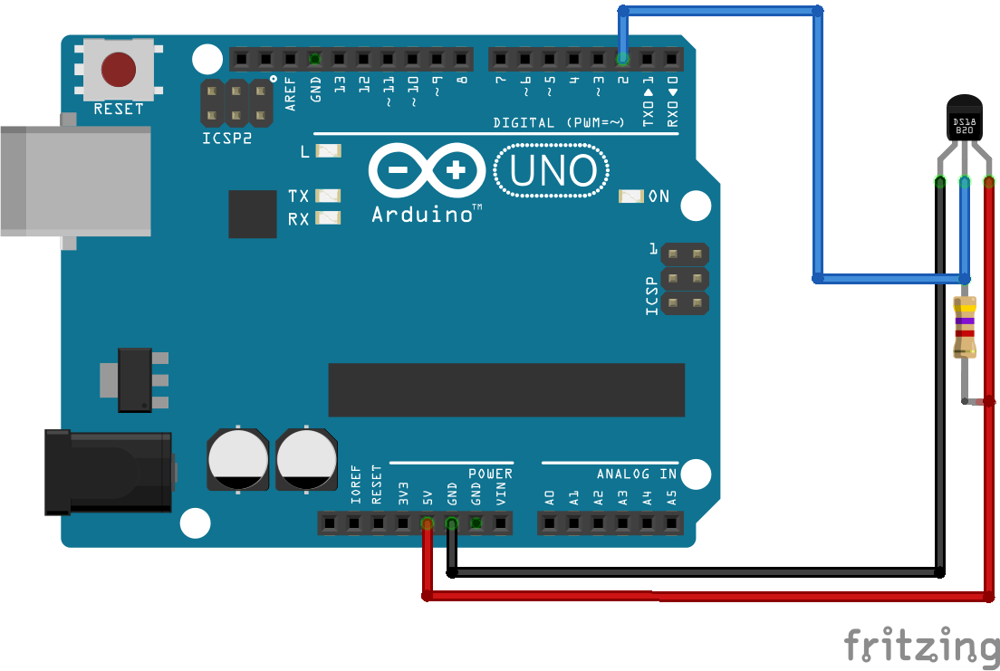

# ArduinoTempMonitor

Arduino Temperature Monitoring System

## Overview

This repository will include the code samples for an ongoing series of Arduino experiments, starting with some really basic circuits and building up over time into a more advanced system.

The topic will be temperature monitoring, with the eventual goal being a distributed Internet of Things (IoT) system with multiple monitoring "nodes", a centralised communications hub for logging and display, and a web-accessible interface.

## Parts List

The parts list will evolve over time as the project progresses, but for the initial few experiments you will need just a few items:

* Arduino Uno or similar (Duemilanove or Nano also work)
* DHT11 Temperature Sensor
* 10K Resistor
* Hookup Wires

## Required Libraries

To work with the DHT11 and DHT22 sensors we will need to install the [Adafruit DHT Library](https://github.com/adafruit/DHT-sensor-library).

If you are using the Arduino IDE v1.6.4 or above you can install the library using the Library Manager.

Manual installation instructions to follow.

## Experiments

### 1. Serial DHT11

Lets start simple and just get some readings from the DHT11 and pass them back to the Serial interface. The wiring for this sketch requires just 4 connections as follows:

* DHT pin 1 to Arduino 5v
* DHT pin 2 to Arduino Digital Pin 2
* DHT pin 4 to Arduino ground
* 10K resistor between DHT pin 1 and DHT pin 2

*Note: DHT pin 3 is left unconnected.*

#### Wiring Diagram



#### Sketch

Code available in `/_01-dht11-serial`

Upload the sketch to your Arduino and then open the serial monitor console (Tools > Serial Monitor) to view the output.

Reads the temperature and heat index (feels like temp) in Celcius, relative humidity in %.

Sample output:

```
DHT11 Serial
Temperature: 19.00c 	Humidity: 88.00% 	Feels Like: 18.68c
Temperature: 19.00c 	Humidity: 88.00% 	Feels Like: 18.68c
Temperature: 19.00c 	Humidity: 88.00% 	Feels Like: 18.68c
Temperature: 19.00c 	Humidity: 87.00% 	Feels Like: 19.00c
Temperature: 19.00c 	Humidity: 87.00% 	Feels Like: 19.00c
```

### 2. Serial DS18B20

> Note: This sketch requires the `OneWire` and `DallasTemperature` libraries.

Building on what we started in the previous experiment, this time we are going to use a Dallas DS18B20 temperature sensor. This is a temperature only device (no humidity) but is more precise and fast than the DHT11.

The wiring for this sketch is similar to the previous example, but we are using a different value for the resistor and the pin order has changed:

* DS pin 1 to Arduino ground
* DS pin 2 to Arduino Digital Pin 2
* DS pin 3 to Arduino 5v
* 4.7K resistor between DS pin 2 and DS pin 3

#### Wiring Diagram



#### Sketch

Code available in `/_02-ds18b20-serial`

Upload the sketch to your Arduino and then open the serial monitor console (Tools > Serial Monitor) to view the output.

Reads the temperature in Celcius.

Sample output:

```
DS18B20 Serial
Temperature: 20.37c
Temperature: 25.31c
Temperature: 27.37c
Temperature: 28.50c
Temperature: 29.37c
Temperature: 30.00c
```
